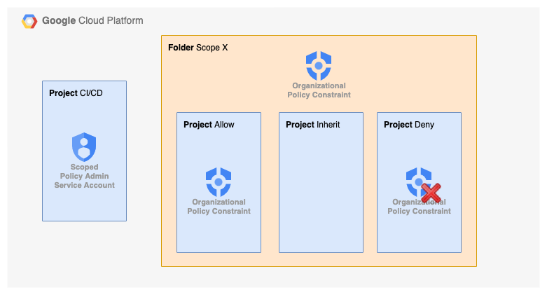

# Organization deployment

This configures the organizational structure used to demonstrate scoped [organizational policy constraint](https://cloud.google.com/resource-manager/docs/organization-policy/org-policy-constraints) adminstration.

The Organization has a "Scope"-folder with three projects: "Allow", "Inherit" and "Deny". The CI/CD service account is granted permissions to configure Organizational Policy Constraints on the "Scope"-folder and "Allowed"-projects using [Resource Tags](https://cloud.google.com/resource-manager/docs/tags/tags-overview).

## Terraform

| File                       | Resources                      |
|:---------------------------|:-------------------------------|
| [/organization_resources.tf](organization_resources.tf) | Folders & Projects deployment  |
| [/organization_tags.tf](organization_tags.tf)      | Resource tags assignments      |
| [/project_iam.tf](project_iam.tf)            | Conditional IAM assignment to manage organizational resources. |